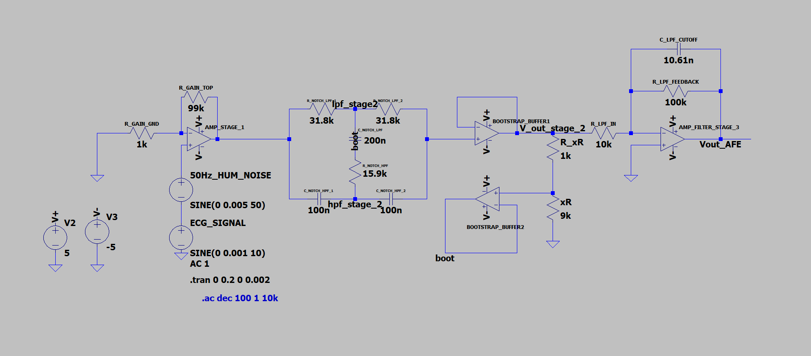

# Analog Front-End (AFE) for ECG Signal Processing

This repository contains the complete design, mathematical analysis, and LTspice simulation of a **3-Stage Active Analog Front-End (AFE)**. The system is engineered to capture a weak microvolt-level electrocardiogram (ECG) biometric signal and purify it by isolating and removing heavy 50 Hz powerline interference and high-frequency instrumentation noise.

---

## 🛠️ System Architecture & Specifications

The processing chain cascades three active operational amplifier stages. The overall performance specifications are detailed in the table below:

| Parameter | Design Specification | Circuit Implementation |
| :--- | :--- | :--- |
| **Target Signal** | 10 Hz ECG Waveform (1 mV Amplitude) | Series AC Voltage Source |
| **Primary Noise Source** | 50 Hz Powerline Hum (5 mV Amplitude) | Series Interference Source |
| **Stage 1 Gain** | +40 dB (100x Voltage Amplification) | Non-Inverting Op-Amp Block |
| **Stage 2 Notch Center** | Exactly 50 Hz | Q-Enhanced Bootstrapped Twin-T Filter |
| **Stage 3 Cutoff Frequency** | 150 Hz | Active Inverting Low-Pass Filter |
| **Total System Gain** | +60 dB (1000x Total Amplification) | Cascaded Midband Response |

---

## 📂 Detailed Component Design Values

The precise component values calculated and implemented in the LTspice schematic are structured stage-by-stage below:

### Stage 1: Pre-Amplifier Block
Provides the primary voltage lift to raise the microvolt-level biopotential signal far above the noise floor of subsequent stages.
* **Active Component:** `AMP_STAGE_1`
* **Gain Calculation:** Gain = 1 + (R_GAIN_TOP / R_GAIN_GND) = 1 + (99k / 1k) = 100 (+40 dB)

### Stage 2: Twin-T Notch Filter Block
Splits the signal into parallel low-pass and high-pass paths to introduce opposing phase shifts that achieve total destructive cancellation at exactly 50 Hz. Uses active feedback bootstrapping to sharpen the filter selectivity (Q).
* **Active Components:** `BOOTSTRAP_BUFFER1`, `BOOTSTRAP_BUFFER2`
* **Feedback Factor (x):** xR / (R + xR) = 9k / (1k + 9k) = 0.9

| Component Group | Schematic Label | Design Value | Function |
| :--- | :--- | :--- | :--- |
| **Low-Pass Resistors** | `R_NOTCH_LPF1`, `R_NOTCH_LPF2` | 31.8k | Upper T-Arm Frequency Selection |
| **High-Pass Capacitors** | `C_NOTCH_HPF1`, `C_NOTCH_HPF2` | 100n | Lower T-Arm Frequency Selection |
| **Center Low-Pass Cap** | `C_NOTCH_LPF` | 200n | Shunt Element (2C) |
| **Center High-Pass Resistor**| `R_NOTCH_HPF` | 15.9k | Shunt Element (R/2) |
| **Active Feedback Divider** | `R_xR` / `xR` | 1k / 9k | Sets Bootstrapping Ratio (x=0.9) |

### Stage 3: Inverting Low-Pass Filter Block
Sweeps away high-frequency instrumentation hiss, RF interference, and residual switching noise while adding a final gain multiplication layer.
* **Active Component:** `AMP_FILTER_STAGE_3`
* **Cutoff Frequency Calculation:** fc = 1 / (2 * pi * R_LPF_FEEDBACK * C_LPF_CUTOFF) = 1 / (2 * pi * 100k * 10.61n) = 150 Hz
* **Stage Gain:** -(R_LPF_FEEDBACK / R_LPF_IN) = -(100k / 10k) = -10 (+20 dB)

---

## 📈 Simulation Results & Technical Justification

### 1. Circuit Schematic Layout
The full cascading active analog circuit layout as built inside LTspice:

### 2. Time-Domain Signal Purification (.tran)
The transient performance proves the operational capabilities of the analog chain:
* **Raw Input Signal:** The target 10 Hz ECG sine wave is entirely illegible, completely buried under a heavy, jagged 50 Hz environmental noise ripple.
* **Pre-Amplifier Output:** Lifts the combined mixed waveform by 40 dB, prepping it for processing.
* **Internal Twin-T Dynamics:** The parallel low-pass and high-pass branch nodes split the signal. At 50 Hz, they maintain a phase shift difference that cancels out the powerline ripple at the summing node.
* **Final Purified Output (Vout_AFE):** Shows a smooth, pristine 10 Hz cardiac wave. The 50 Hz component is flattened out entirely after a brief transient settling period.

---

## 📁 Repository Navigation

To examine individual stage analyses, equations, and local waveforms, visit the dedicated sub-folders:
* **[/Stage1-Pre-Amplifier](./Stage1-Pre-Amplifier):** Gain derivations, non-inverting terminal equations, and stage input/output graphs.
* **[/Stage2-Twin-T-Notch](./Stage2-Twin-T-Notch):** Phase-splitting cancellation physics, bootstrapping math, and internal branch node behavior.
* **[/Stage3-Low-Pass-Filter](./Stage3-Low-Pass-Filter):** 150 Hz RC corner frequency math, high-frequency attenuation limits, and the complete system AC frequency Bode Plot.
