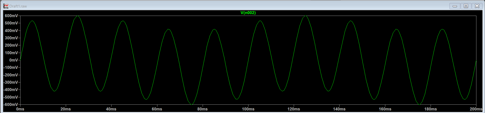

# Stage 1: Pre-Amplifier Block – Signal Boosting

This stage handles the primary amplification of the raw biopotential data. Because raw ECG signals are typically under a few millivolts, they must be boosted immediately before entering any filtering blocks to maintain a high Signal-to-Noise Ratio (SNR) and prevent downstream signal degradation.

## 🔧 Component Specifications & Parameters

| Component | Schematic Label | Value | Description |
| :--- | :--- | :--- | :--- |
| **Op-Amp** | `AMP_STAGE_1` | Ideal / LT1001 | Low-noise operational amplifier |
| **Feedback Resistor** | `R_GAIN_TOP` | 99 kΩ | Determines upper feedback path resistance |
| **Gain Resistor** | `R_GAIN_GND` | 1 kΩ | Connects inverting terminal to ground |

---

## 📐 Mathematical Derivation

This stage uses a classic **Non-Inverting Amplifier** topology. The input signal is fed directly into the positive terminal (+), ensuring exceptionally high input impedance so it doesn't load down the biometric sensors.

The voltage gain ($A_v$) is calculated using the standard ideal closed-loop equation:

$$A_v = 1 + \frac{R_{TOP}}{R_{GND}}$$

Substituting our calculated design values:

$$A_v = 1 + \frac{99\text{ k}\Omega}{1\text{ k}\Omega} = 1 + 99 = 100$$

To express this voltage amplification in decibels (dB) for standard system characterization:

$$\text{Gain (dB)} = 20 \cdot \log_{10}(100) = 40\text{ dB}$$

---

## 📈 Stage Verification Plots

* **Amplifier Output Waveform:** Stage 1 scales both the input 10 Hz wave and the noise linearly by exactly 100x, generating a stable peak-to-peak output signal.

