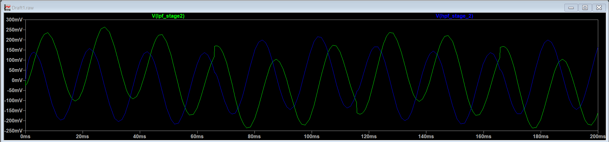
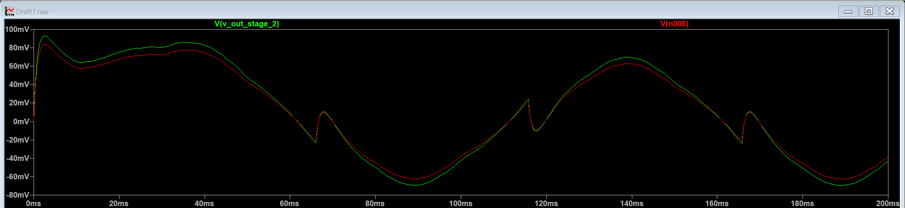
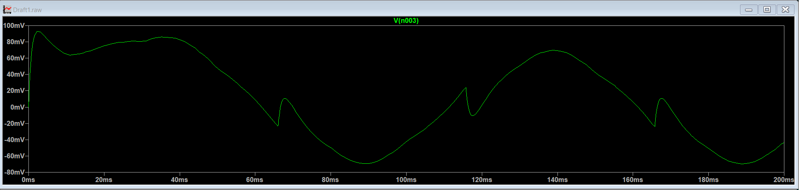
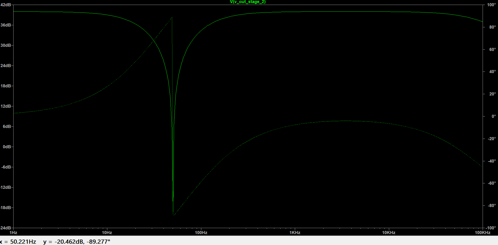
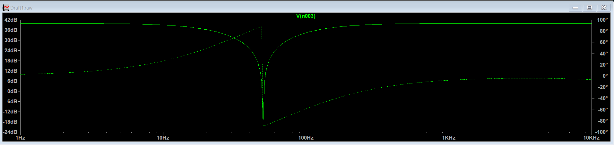

# Stage 2: Active Twin-T Notch Filter – 50 Hz Noise Cancellation

This stage is the core noise-cleanup block of the Analog Front-End pipeline. It targets and completely eliminates the 50 Hz powerline hum picked up from wall outlets and ambient environment fields without attenuating the critical 10 Hz ECG signal nearby.

## 📐 Filter Physics & Active Feedback Q-Enhancement

A standard passive Twin-T filter has an incredibly wide notch, meaning it would accidentally quiet down your 10 Hz heart signal along with the 50 Hz noise. 

To fix this, this circuit implements **active bootstrapping** via `BOOTSTRAP_BUFFER2`. By feeding a fraction of the output signal back into the center of the filter using the active `boot` node network, we alter the current leakage paths at surrounding frequencies. This drastically sharpens the filter's selectivity (Q-factor), keeping the 10 Hz passband completely flat while creating a razor-sharp drop at exactly 50 Hz.

The exact proportion of feedback is controlled by a low-impedance voltage divider network. We define the feedback fraction **$x$** using the voltage divider ratio:

$$x = \frac{R_{fb2}}{R_{fb1} + R_{fb2}}$$

### 💡 Dynamic Q-Factor Tuning
Without active feedback ($x = 0$), a passive Twin-T configuration has a static, highly dampening quality factor of $Q = 0.25$. When the active bootstrapping loop is closed, the system's effective selectivity scales dynamically according to the relation:

$$Q_{active} = \frac{0.25}{1 - x}$$

By selecting high-precision resistors to lock in $x \approx 0.95$, the circuit amplifies the effective system selectivity to **$Q \approx 5$**. This narrows the rejection band around the center frequency while keeping the diagnostic 10 Hz baseline completely flat and unattenuated.

The center notch frequency ($f_0$) is derived using:

$$f_0 = \frac{1}{2\pi \cdot R \cdot C} = \frac{1}{2\pi \cdot 31.83\text{ k}\Omega \cdot 100\text{ nF}} \approx 50\text{ Hz}$$

---

## 📈 Stage Verification Plots

* **Internal Node Analysis:** Probing the internal parallel paths shows the destructive phase cancellation at 50 Hz.

* **Time Domain Notch Response:** Shows the tracking and stabilization of the signal immediately after leaving the notch section.

* **Frequency Response:** Demonstrates the sharp, narrow rejection performance centered squarely at 50 Hz.

