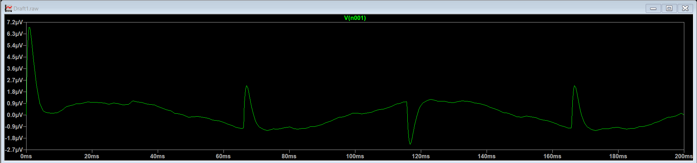
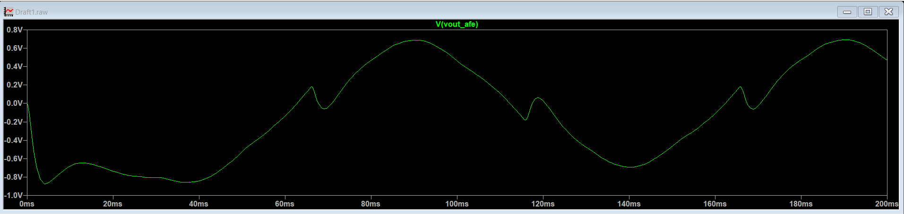

# Stage 3: Inverting Low-Pass Filter Block

The final stage sweeps away high-frequency instrumentation hiss, external RF interference, and residual high-order switching noise while adding a final voltage gain layer to optimize the dynamic range for subsequent ADC microcontrollers.

## 🔧 Component Design Parameters

| Component Group | Schematic Label | Design Value | Function |
| :--- | :--- | :--- | :--- |
| **Input Resistor** | `R_LPF_IN` | 10 kΩ | Sets input impedance and base gain ratio |
| **Feedback Resistor**| `R_LPF_FEEDBACK`| 100 kΩ | Establishes overall stage amplification |
| **Cutoff Capacitor** | `C_LPF_CUTOFF` | 10.61 nF | Limits high-frequency high-pass bounds |

---

## 📐 Cutoff Frequency & Stage Gain Derivation

This stage utilizes an **Active Inverting Low-Pass Filter** topology. The corner/cutoff frequency ($f_c$) above which signals are attenuated is defined by:

$$f_c = \frac{1}{2\pi \cdot R \cdot C}$$

Substituting our component selections:

$$f_c = \frac{1}{2\pi \cdot 100\text{ k}\Omega \cdot 10.61\text{ nF}} \approx 150\text{ Hz}$$

The midband voltage gain ($A_v$) for this inverting configuration provides an extra boost:

$$A_v = -\frac{R_{FEEDBACK}}{R_{IN}} = -\frac{100\text{ k}\Omega}{10\text{ k}\Omega} = -10 \text{ (+20 dB)}$$

---

## 📈 Stage Verification Plots

* **Virtual Ground Configuration:** Displays the steady single-supply reference rail stabilizing node.

* **Final System Output:** The pristine 10 Hz output waveform totally isolated from high and low frequency interferers.

